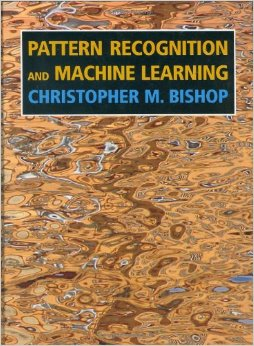
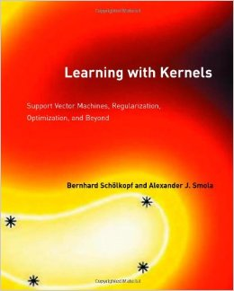
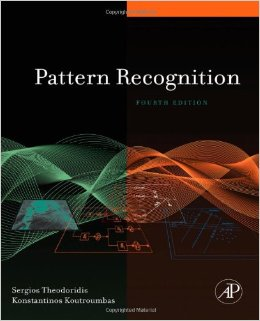

## SVM

### 资料

* [支持向量机通俗导论（理解SVM的三层境界）](http://blog.csdn.net/v_july_v/article/details/7624837) 

* [Coursera 斯坦福机器学习 2014.04](https://class.coursera.org/ml-005/) Lecture XII

* [机器学习实战](http://www.amazon.cn/%E6%9C%BA%E5%99%A8%E5%AD%A6%E4%B9%A0%E5%AE%9E%E6%88%98-%E7%BE%8E-Peter-Harrington/dp/B00M2DL02A/ref=sr_1_1?ie=UTF8&qid=1413116754&sr=8-1&keywords=%E6%9C%BA%E5%99%A8%E5%AD%A6%E4%B9%A0%E5%AE%9E%E6%88%98)，第6章，原理及代码

* [www.svms.org](http://www.svms.org/)

* SVM库：[liblinear](http://www.csie.ntu.edu.tw/~cjlin/liblinear/)，[libsvm](http://www.csie.ntu.edu.tw/~cjlin/libsvm/)，...

* Kernel：String Kernel, chi-square kernel，histogram intersection kernel, polynomial kernel，Gaussian kernel ...

### 原理

#### 1. Coursera斯坦福机器学习 2014.04 Lecture XII [[课程主页]](https://class.coursera.org/ml-005/) [[PPT及笔记]](../ml-pdf/CStML07SVM.pdf) 

* 相比Logistic Regression，SVM希望cost function的惩罚效果能够更加严厉，给训练样本的分类设置一个较大的margin
		
	> Logistic Regression：h&theta;(x)>0时判为正例，h&theta;(x)<0时判为负例
		
	> SVM: h&theta;(x)>1（即z&theta;(x)足够大）才判断为正例，h&theta;(x)<-1（及z&theta;(x)足够接近0）时才判为负例。
		
	> （其中 &theta; 为要训练的参数；z&theta;(x)为关于x的线性多项式；h&theta;(x) 为 hypothesis function）
	
* 其效果是样本类别距离分类面距离最大，不容易被个别样本影响而导致过拟合。
	
	> cost function最小，要求|&theta;|最小，分类面(&theta;)与样本特征向量(x)的内积最小
		
	> 向量内积 <U,V> = |U||V|cos(U,V)，也意味着要求向量&theta;与x的夹角接近90o，在众多样本特征向量xi的作用下，分类面被训练成距离两类样本距离最远
	
	> （为了简化，假定 &theta;0 = 0 ）
	
	???
	
* Kernel（以高斯Kernel为例）：
	
	> 将非线性模型的样本，转化为线性模型样本，这样就可以用SVM非线性样本分类的Decision Boundary，实现非线性样本的分类。
		
	> 方法：在非线性样本的正例样本空间中，找N个landmark点，以样本与N个landmark的相似度（f1，f2，... fn）作为SVM的样本输入（其中与landmarki相似度越高，fi约接近1，反之则约接近0）
		
	> fi = similarity(x, landmarki) = exp ( - ||x-landmarki||2 / (2&delta;2) )
		
	> SVM对样本进行训练，得到参数&theta;，使得样本被分为两类：距离landmarks近的，距离landmark远的
		
* SVM参数（C，&delta;）
		
	* C相当于Logistic Regression中的 1/&lambda;，调节variance和bias： 
		
		> Large C：lower bias, high variance（容易过拟合）
			
		> Smaller C：higher bias, lower variance （容易欠拟合）
		
	* &delta;，调节kernel的灵敏度：
		
		> Larger &delta;2：fi平滑，Higher Bias, Lower Variance (容易欠拟合）
			
		> Smaller &delta;2：fi变化灵敏，Lower Bias, Higher Variance（容易过拟合）
	
* Logistic Regression和SVM之间的选择：
		
	* 相对于样本数，特征非常多：用Logistic Regression就够了，SVM without a Kernel也可以
	
	* 特征较少，样本数适度（例如: n&isin;[1,1000]，m&isin;[10,10000]）：SVM with Gaussian Kernel来提高训练准确度，同时训练量也能够承受
	
	* 特征较少，样本非常多（例如: n&isin;[1,1000]，m>50000）：训练量太大，增加新特征，使用Logistic Regression比较合适

#### 2. 机器学习实战 第6章 支持向量机 [[书]]((http://www.amazon.cn/%E6%9C%BA%E5%99%A8%E5%AD%A6%E4%B9%A0%E5%AE%9E%E6%88%98-%E7%BE%8E-Peter-Harrington/dp/B00M2DL02A/ref=sr_1_1?ie=UTF8&qid=1413116754&sr=8-1&keywords=%E6%9C%BA%E5%99%A8%E5%AD%A6%E4%B9%A0%E5%AE%9E%E6%88%98)) [[代码]](./MLinActCh06/)

* 数学推导

	> Christopher M. Bishop, Pattern Recognition and Machine Learning (Springer, 2006) [[购买](http://www.amazon.com/Pattern-Recognition-Learning-Information-Statistics/dp/0387310738)][[Notes](../ml-pdf/Notes__Pattern_Recognition_and_Machine_Learning.pdf)]
	
	> 

	> Bernhard Schlkopf and Alexander J. Smola, Learning with Kernels: Support Vector Machines Regularization, Optimization, and Beyond (MIT Press, 2001) [[购买]](http://www.amazon.com/Learning-Kernels-Regularization-Optimization-Computation/dp/0262194759)
	
	> 

* Platt的SMO（Sequential Minimal Optimization）算法

	> John C. Platt, "[Using Analytic QP and Sparseness to Speed Training of Support Vector Machines](../ml-pdf/SVMSMO1999_smo-nips.pdf)" in Advances in Neural Information Processing System 11, M. S. Kearns, S. A. Solla, D.A.Cohn, eds(MIT Press, 1999), 557-63
	
	> S. S. Keerthi, S. K. Shevade, C. Bhattacharya, and K. R. K. Murthy, "[Improvements to Platt's SMO Algorithm for SVM Classifier Design](../ml-pdf/SVMSMO2001_keerthi-svm.pdf)", Neural Computation 13, no.3, (2001), 637-49

* SVM多分类器

	> C. W. Hus, and C. J. Lin, "[A Comparison of Methods for Multiclass Support Vector Machines](../ml-pdf/MCSVM2002_hsu2001multiclass.pdf)," IEEE Transactions on Neural Networks 13, no. 2 (March 2002), 415-25 
	
* SVM的c参数对分类结果的影响：

	> Sergios Theodoridis and Konstantinos Koutroumbas, Pattern Recognition, 4th ed. (Academic Press, 2009), 133 [[购买](http://www.amazon.com/Pattern-Recognition-Edition-Sergios-Theodoridis/dp/1597492728)]

	> 

* 特点：
	
	> 优点：泛化错误率低，计算开销不大，结果容易理解
	
	> 缺点：对参数调节和核函数选择敏感，原分类器不加修改时，仅适用于处理二类问题

* 原理 (公式的推导参考资料：数学推导）

	* 分隔数据集的超平面
	
		> 在找到一个超平面（separating hyperplane）将特征空间中的数据集分隔开来，同时找到距离分隔超平面最近的点，希望这些点到分隔面的距离——被称为间隔（margin）——尽可能地大，以使得分类器尽可能健壮（注：也有论文或书籍中，间隔（margin）是指点到分隔面最小距离的2倍）
	
		> 超平面用wTx+b=0来表示（其中w是向量，b是常数、似于Logistic回归中的截距w0）,展开来就是 b+w1x1+w2x2+...+wnxn=0
		
		> 为了方便假定b=0，对于超平上任意一个点x0，由wTx0=0可知，向量w与向量x垂直（内积定义），因此w就是超平面的法线
		
		> 点A到分隔面的距离（法线/垂线的长度）：|wTA+b| / ||w||。
		
		> ???
		
	
	* 分类及数学表示
	
		> 用类似海维塞得阶跃函数（即单位阶跃函数）的函数对wT+b作用得到f(wT+b)，其中当u<0时f(u)输出-1，反之输出+1 （与Logistic的类别标签0或1不同）
		
		> 当数据点处于正方向（即+1类）并且离分隔超平面很远时，wTx+b会是一个很大的整数，由于label=+1，label*wT会是一个很大的正数
		
		> 当数据点处于负方向（即-1类）并且离分隔超平面很远时，wTx+b会是一个很大的负数，由于label=-1，label*wT仍是一个很大的正数
	
	* 训练目标
	
		> 目标是找出w和b，为此必须找到具有最小间隔的数据点，这些点被成为**支撑向量**
		
		> 
	
	> // to be continue

	
	
